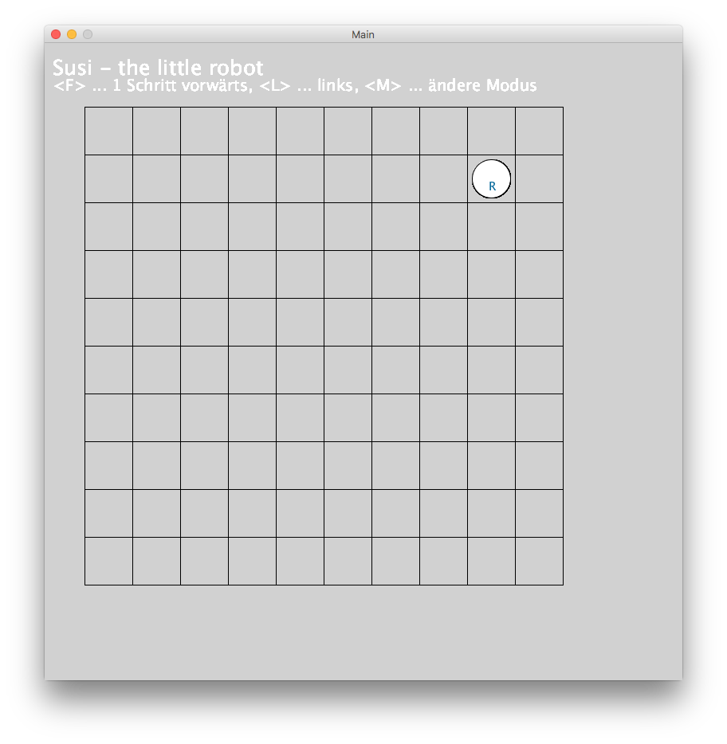

# Übung Robot - grafische Darstellung

## Lehrziel

- Verwenden von Java-Entity-Klassen 
- Konstruktoren (Standard-Konstruktor, Konstruktoren mit Parameter)
- Anwende der grafischen Bibliothek Processing

## Ausgangssituation

In der letzten Übung wurde ein Programm erstellt, mit dem sich der Roboter auf einem Feld bewegen kann. Problem dabei ist, 

- daß der Roboter auch das Feld verlassen kann und
- seine "Blickrichtung" nicht ersichtlich ist

## Aufgabenstellung

Erweitern Sie nun das Programm und erstellen Sie zwei Modi:

1. Der Roboter kann das Feld nicht verlassen
2. Der Roboter verläßt das Feld und erscheint auf der anderen Seite

Zwischen den beiden Modi kann mittels der Taste M gewechselt werden. Die beiden Modi lauten RESTRICT und TELEPORT.

Die Blickrichtung soll entsprechend dem aktuell eingestellten Modus und der Bewegungsrichtung dargestellt werden.

Die neue grafische Darstellung des Roboter sieht wie folgt aus:

Mit den Tasten <F> und  <L> kann unser Roboter gesteuert werden.

Taste | Funktion | Beschreibung
--- | --- | ---
F | Forward | einen Schritt vorwärts
L | Left | nach links um 90° drehen 
M | alter mode | Der Modus wechselt zwischen RESTRICT und TELEPORT

## Erweiterung

Erstellen Sie einen zweiten andersfarbigen Roboter, der durch die Tasten 4 (statt F) und 6 (statt L) gelenkt werden kann.

*** Viel Spaß ***
